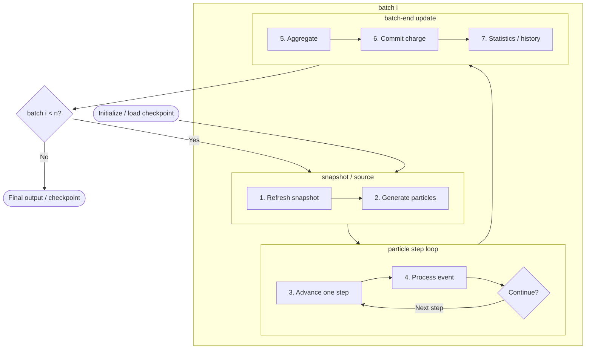

title: Computational model overview

Lang: [English](Algorithms.en.md) | [日本語](Algorithms.md)

# Computational model overview

BEACH couples the electric field produced by charge on triangular surfaces with charged-particle motion in
batches. Boundary-element charge acts as the source for electric-field and potential evaluation, and particle collision charge
accumulates on the same elements.

## The n-batch computation flow

Here, `n = sim.batch_count`. A resumed run starts after the batches completed in the checkpoint and repeats the
same flow until the cumulative count reaches `n`.

Particles in one batch share the field snapshot fixed in step 1. Surface charge committed in step 6 first
contributes to the field when step 1 runs for the next batch.

### 1. Refresh the field and outer-model snapshot

The field and potential held fixed during particle tracking are built from `q_elem` committed through the
previous batch. See [Field evaluation](FieldSolvers.en.html) for direct, treecode, and FMM selection,
[periodic2 electrostatics](PeriodicElectrostatics.en.html) for periodic sums, and
[Outer plasma models](OuterPlasmaModels.en.html) for coupling to the exterior.

### 2. Generate the batch particles

BEACH creates the particles to track in this batch from `volume_seed`, `reservoir_face`, and `photo_raycast`
sources. Reservoir counts follow inflow flux and `batch_duration`; photoelectrons originate at the first surface
hit by a ray. See [Particle sources](ParticleSourcesBoundaries.en.html),
[Reservoir injection](ReservoirInjection.en.html), and
[Photoelectron emission and lifecycle](PhotoelectronEmission.en.html).

### 3. Advance a particle by one step

In the fixed snapshot and optional uniform magnetic field, BEACH updates velocity with the Boris method and
position with a same-time trapezoidal rule. This produces a candidate trajectory; event processing determines
the final state within the step. See [Boris particle update](BorisPusher.en.html).

### 4. Select and process the first event

BEACH selects the earliest triangle hit or box-face crossing along the candidate trajectory, then applies
absorption, reflection, periodic wrapping, escape, or outer return. A surviving particle with steps remaining
returns to step 3. See [Particle collision and boundary events](ParticleEvents.en.html) and
[Particle escape and return](ParticleEscapeReturn.en.html).

### 5. Aggregate batch results

Surface-hit charge deltas, photoemission reaction charge, particle outcomes, and outer-interface diagnostics are
aggregated. OpenMP keeps collision charge thread-local, and quantities that must be global are reduced across MPI
ranks. See [Run a simulation](Execution.en.html) for the parallel execution structure.

### 6. Commit surface charge

The global charge delta is added to `q_elem` once. Floating conductors are then relaxed toward equipotential while
preserving object charge when requested. See [Surface charge update](SurfaceModels.en.html) for insulator charging and conductor
processing, [Photoelectron emission and lifecycle](PhotoelectronEmission.en.html) for reaction-charge signs, and
[Reading output files](OutputGuide.en.html) for species-resolved charge balance.

### 7. Update statistics and history state

BEACH updates absorption, escape, `max_step` survivor counts, and `tol_rel`, then writes charge and potential
history at the configured stride. `tol_rel` is a monitoring metric, not an early-stop condition. See
[Output files](OutputGuide.en.html) and [Run a simulation](Execution.en.html). Final results and the checkpoint are
written after all `n` batches complete.

## State carried between batches

| State | Role in the next batch |
| --- | --- |
| Element charge `q_elem` | Becomes the field source in step 1 |
| Reservoir residuals, RNG, and outer state | Continue particle generation and outer refresh |
| Statistics and history | Preserve cumulative results and the restart position |
| Model, mesh, and species fingerprints | Validate checkpoint compatibility |

`sim.dt` is the particle step size in step 3. `batch_duration` instead connects particle supply in step 2 with
the charge update in step 6. Check its sensitivity using
[`batch_duration` stability and steady value](BatchDurationStability.en.html).

See the [Finite-image periodic2 configuration](FinitePeriodicConfiguration.en.html) and
[Infinite-periodic periodic2 with outer plasma](InfinitePeriodicOuterConfiguration.en.html) for complete periodic
setups. Input keys are listed in [Configuration parameters](Parameters.en.html), and discretization and result
convergence are covered in [Validate simulation results](ValidationGuide.en.html).
