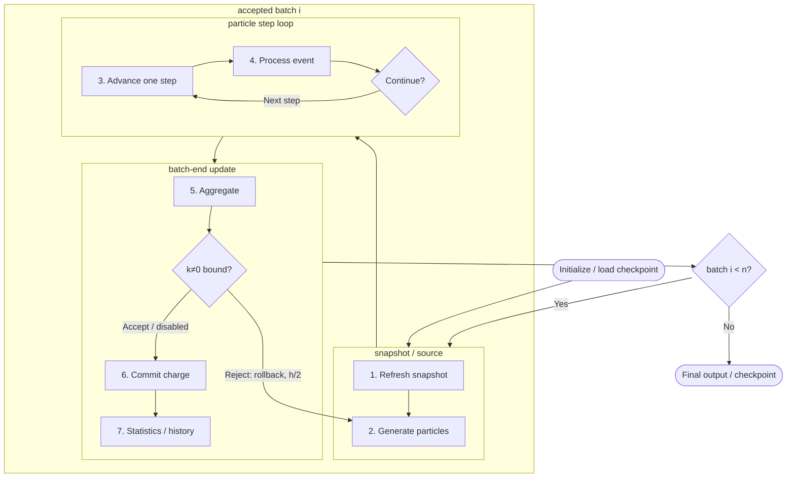

title: Computational model overview

Lang: [English](Algorithms.en.md) | [日本語](Algorithms.md)

# Computational model overview

BEACH couples the electric field produced by charge on triangular surfaces with charged-particle motion in
batches. Boundary-element charge acts as the source for electric-field and potential evaluation, and particle collision charge
accumulates on the same elements.

## The n-batch computation flow

Here, `n = sim.batch_count`. A resumed run starts after the accepted batches completed in the checkpoint and
repeats the same flow until the cumulative accepted count reaches `n`.

Particles in one trial share the field snapshot fixed in step 1. Surface charge committed in step 6 first
contributes to the field when step 1 runs for the next accepted batch.

With `[periodic2].max_nonzero_mode_potential_step > 0`, BEACH repeats steps 2
through 5 with widths `h0 = sim.batch_duration`, `h0/2`, `h0/4`, and so on.
At every panel centroid it evaluates the $k\ne0$ potential produced by the
difference between candidate and batch-start charge, and accepts the first
trial whose maximum absolute value is within the configured limit. A rejection
fully restores the pre-trial RNG and macro-particle residuals before rebuilding
the same batch at a shorter width. This trial loop is specific to
`cached_kneq0` and does not support an ordinary `volume_seed`. Time-scaled `boundary_inflow`, `plane_source`, and
deprecated `reservoir_face` must use `target_macro_particles_per_batch`; fixed `w_particle` reservoirs are rejected.

### 1. Refresh the field snapshot

The field and potential held fixed during particle tracking are built from `q_elem` committed through the
previous batch. See [Field evaluation](FieldSolvers.en.html) for direct,
treecode, and FMM selection and
[periodic2 electrostatics](PeriodicElectrostatics.en.html) for periodic sums.

### 2. Generate the batch particles

BEACH creates the particles to track in this trial from `volume_seed`, `plane_source`, boundary-reservoir inflow,
deprecated `reservoir_face`, and `photo_raycast`. Reservoir counts follow inflow flux and the trial width; photoelectrons originate at the first surface
hit by a ray. On an adaptive retry, particle counts and weights are recomputed
from the restored RNG state and the shorter trial width. See [Particle sources and boundary inflow](ParticleSourcesBoundaries.en.html),
[boundary-reservoir inflow and velocity sampling](ReservoirInjection.en.html), and
[Photoelectron emission and lifecycle](PhotoelectronEmission.en.html).

### 3. Advance a particle by one step

In the fixed snapshot and optional uniform magnetic field, BEACH updates velocity with the Boris method and
position with a same-time trapezoidal rule. This produces a candidate trajectory; event processing determines
the final state within the step. See [Boris particle update](BorisPusher.en.html).

### 4. Select and process the first event

BEACH selects the earliest triangle hit or box-face crossing along the candidate trajectory, then applies
absorption, reflection, periodic wrapping, escape, or potential-barrier reflection. A surviving particle with steps remaining
returns to step 3. See [Particle collision and boundary events](ParticleEvents.en.html) and
[Particle escape and return](ParticleEscapeReturn.en.html).

### 5. Aggregate results and test the adaptive trial

Surface-hit charge deltas, photoemission reaction charge, and particle outcomes are
aggregated. OpenMP keeps collision charge thread-local, and quantities that must be global are reduced across MPI
ranks. See [Run a simulation](Execution.en.html) for the parallel execution structure.

Under adaptive progression, this aggregate forms the candidate charge. The
cached $k\ne0$ potential operator then applies the
configured bound. A failed trial is rejected without a commit. This test is a
frozen-field local-voltage trust bound, not an estimate of local truncation
error.

For adaptive runs, the OpenMP particle loop uses a static partition so that a
retry is reproducible at the same thread count, together with a conservative
roundoff guard at the acceptance boundary. Bitwise identity across different
thread counts is not guaranteed.

### 6. Commit surface charge

Only the accepted trial's global charge delta is added to `q_elem`, and it is added once. Floating conductors are then relaxed toward equipotential while
preserving object charge when requested. See [Surface charge update](SurfaceModels.en.html) for insulator charging and conductor
processing, [Photoelectron emission and lifecycle](PhotoelectronEmission.en.html) for reaction-charge signs, and
[Inspect Output Files](OutputGuide.en.html) for species-resolved charge balance.

### 7. Update statistics and history state

For the accepted trial only, BEACH updates absorption, escape, `max_step`
survivor counts, and `tol_rel`, adds the accepted width to
`simulated_time_s`, then writes charge and potential history at the configured
stride. `tol_rel` is a monitoring metric, not an early-stop condition. Rejected
trials do not enter statistics, history, or the charge ledger. See
[Inspect Output Files](OutputGuide.en.html) and [Run a simulation](Execution.en.html).
Final results and the checkpoint are written after all `n` accepted batches complete.

## State carried between batches

| State | Role in the next batch |
| --- | --- |
| Element charge `q_elem` | Becomes the field source in step 1 |
| Reservoir residuals, RNG, and outer state | Continue particle generation and outer refresh |
| Statistics, history, and `simulated_time_s` | Preserve accepted-batch results and the restart position |
| Model, mesh, and species fingerprints | Validate checkpoint compatibility |

`sim.dt` is the particle step size in step 3. `batch_duration` instead connects particle supply in step 2 with
the charge update in step 6. Under adaptive progression it is the maximum
trial width; the accepted trial width is the physical time actually advanced. Check its sensitivity using
[`batch_duration` stability and steady value](BatchDurationStability.en.html).

See the [Finite-image periodic2 configuration](FinitePeriodicConfiguration.en.html)
and [periodic2 electrostatics](PeriodicElectrostatics.en.html) for complete
periodic setups. Input keys are listed in [Configuration parameters](Parameters.en.html), and discretization and result
convergence are covered in [Validate simulation results](ValidationGuide.en.html).
