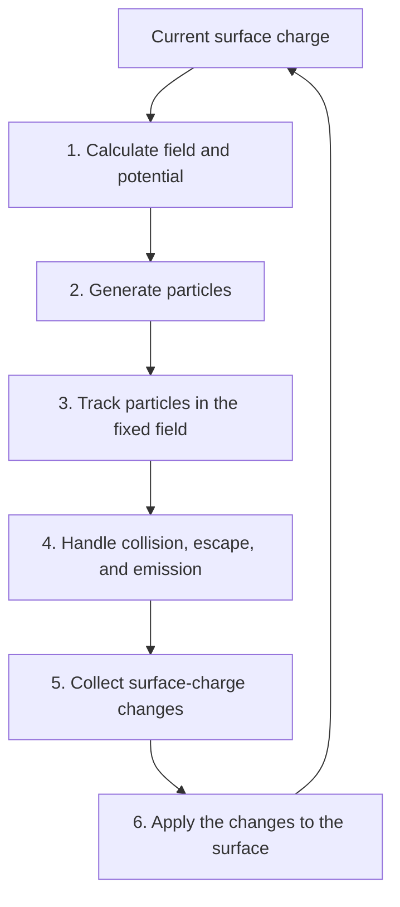

title: The BEACH computation cycle

Lang: [English](Algorithms.en.md) | [日本語](Algorithms.md)

# The BEACH computation cycle

This page answers one question: in what order does BEACH update surface charge, fields, and particle trajectories?
BEACH repeatedly builds a field from the current surface charge, tracks particles in that field, and applies the charge
of particles that reach a surface. The repetition unit is a batch.

> **The essential rule**
>
> The field does not change while one batch is being computed. Charge changes produced in that batch are applied to
> the surface at the end of the batch and first affect the field of the next batch.

After reading this page, you should be able to distinguish the roles of `sim.dt`, `sim.batch_duration`, and
`sim.batch_count`, and identify which update stage an output history represents.

## What BEACH computes directly

The main state held by BEACH is surface charge on each triangle element. BEACH calculates electric field and potential
from that charge and configured external fields, then tracks charged particles until they hit a surface or leave the
computational region. Surface-charge changes from absorption and emission affect a later field.

BEACH does not directly calculate charge distributed through space or the time evolution of plasma outside the
computational region. When an outer-sheath response is needed, a separate
[quasistatic matching-plane coupling](MatchingPlaneCoupling.en.html) can be connected.
[`SPEC.md`](../SPEC.md) is the source of truth for the complete implemented and unsupported feature set.

## The six-stage cycle

In an ordinary configuration, one pass through this cycle is one batch. After `sim.batch_count` batches, BEACH writes
the final mesh, statistics, histories, and checkpoint and then exits.

## What happens in one batch

1. **Calculate electric field and potential.** The field is built from the surface charge at batch start. Whether the
   run uses Direct, Treecode, or FMM, the field used by the subsequent particle tracking is fixed at this point.
2. **Generate particles.** BEACH follows the configured supply method to create initial particles, particles entering
   from inside or outside the region, and particles emitted from a surface.
3. **Track particles.** Each particle advances in increments of `sim.dt`. BEACH searches the candidate trajectory for
   the first intersection with a triangle or box boundary.
4. **Handle each particle's destination.** BEACH resolves surface absorption, passage or reflection at a boundary,
   escape from the computational region, and configured surface emission, then classifies the outcome.
5. **Collect charge changes.** Absorption and emission contributions are accumulated per triangle. They have not yet
   changed the surface charge from which this batch's field was calculated.
6. **Apply the surface-charge update.** BEACH adds the collected change once and updates statistics and histories. The
   new charge first enters the field calculation in stage 1 of the next batch.

See [particle collision and boundary events](ParticleEvents.en.html) for event ordering and
[how surfaces charge](SurfaceModels.en.html) for the treatment after a surface hit.

## Why the field stays fixed within a batch

Using one field for every particle in a batch separates particle tracking from the surface-charge update. The tradeoff
is that a batch that changes charge too much makes the frozen-field approximation coarse.

A research case must therefore test the charge change per batch separately from the particle trajectory time step.
Vary `sim.batch_duration` or the macro-particle count and check whether potential, charge, and current remain unchanged
at the required accuracy. See [how to choose `batch_duration`](BatchDurationStability.en.html) for the comparison procedure.

## Distinguish three time and count controls

| Setting | What it changes | Outputs to examine first |
| --- | --- | --- |
| `sim.dt` | Resolution of one particle advance and event time | Collision position, trajectory, escape / survivor counts |
| `sim.batch_duration` | Time-proportional inflow and the physical interval between surface-charge updates | Injection per batch, charge, potential, and current |
| `sim.batch_count` | Number of computation cycles | Reached physical time, history length, and stationarity |

A case such as a `volume_seed` with `sim.batch_duration=0`, which specifies a direct particle count per batch, has no
assigned physical duration in seconds. Time-proportional sources such as boundary inflow instead derive their particle
count from flux and `sim.batch_duration`. `tol_rel` monitors surface-charge change; it is not an automatic stopping
condition in the current implementation.

## State carried between batches

The next batch inherits updated surface charge, accumulated statistics, physical time, and the state required to continue
the same particle supply. A restart restores the required state and continues the same cycle.

Developers changing internal state, retry restoration, or MPI / OpenMP reduction should see
[runtime architecture](Architecture.en.html) and
[development and testing](Workflow.en.html).

## Nonstandard execution paths

After understanding the ordinary path, open only the specialized page needed by your case.

| Needed feature | Dedicated page |
| --- | --- |
| Limit the field change per batch and retry with a shorter interval | [How to choose `batch_duration`](BatchDurationStability.en.html) |
| Couple a quasistatic outer 1-D sheath response | [Quasistatic matching-plane coupling](MatchingPlaneCoupling.en.html) |
| Treat the mean and nonuniform fields of a periodic surface | [`periodic2` electrostatics](PeriodicElectrostatics.en.html) |
| Choose Direct, Treecode, or FMM | [Choose a field solver](FieldSolvers.en.html) |

## Where to go next

- Observe inter-batch feedback in a runnable case: [10-minute tutorial](Tutorial.en.html)
- Decide where particles enter: [Choose where particles enter](ParticleSourcesBoundaries.en.html)
- Choose a surface model: [How surfaces charge](SurfaceModels.en.html)
- Check the charge ledger in outputs: [Inspect output files](OutputGuide.en.html)
- Validate discretization and physical interpretation: [Validation guide](ValidationGuide.en.html)
