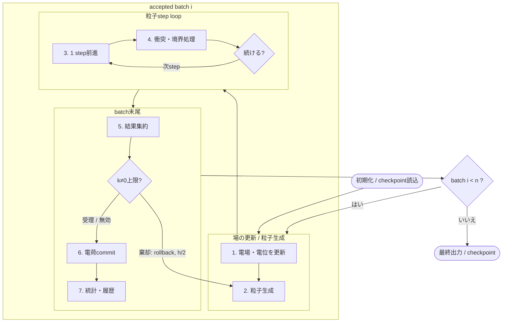

title: 計算モデルの全体像

Lang: [日本語](Algorithms.md) | [English](Algorithms.en.md)

# 計算モデルの全体像

BEACHは、表面電荷が作る電場と、その電場中を運動する荷電粒子をbatch単位で結合します。
三角形要素上の電荷から電場と電位を評価し、粒子が衝突した要素へ新たな電荷を蓄積することで、
表面帯電の時間発展を計算します。

## n batchの計算フロー

`n = sim.batch_count`です。再開時はcheckpointに記録された次のaccepted batchから処理を再開し、
受理済みbatchの総数が`n`に達するまで同じ流れを繰り返します。

同じtrialの粒子は、手順1で確定した電場と電位を共有します。手順6で更新した表面電荷が
場へ反映されるのは、次のaccepted batchの手順1です。

`[periodic2].max_nonzero_mode_potential_step > 0`では、図中の手順2から5を
`h0 = sim.batch_duration`、`h0/2`、`h0/4`、…の順で試します。候補電荷とbatch開始電荷の差が作る
$k\ne0$電位を全panel重心で評価し、その最大絶対値が設定上限以下となる最初のtrialだけを受理します。
棄却時はRNGとmacro粒子数残差をtrial前へ完全に戻し、短い幅で同じbatchを作り直します。
このtrial loopは`cached_kneq0`専用であり、`volume_seed`には対応しません。`reservoir_face`は
`target_macro_particles_per_batch`方式だけを受理し、固定`w_particle`は拒否します。

### 1. 電場・電位snapshotを更新

前batchまでにcommitされた`q_elem`から、粒子追跡中に固定する電場と電位を作ります。direct、treecode、
FMMの選択は[場の評価](FieldSolvers.html)、周期和は[periodic2静電場](PeriodicElectrostatics.html)で説明します。

### 2. batch粒子を生成

`volume_seed`、`reservoir_face`、`photo_raycast`から、そのtrialで追跡する粒子を作ります。reservoir粒子の
個数はtrial幅から決まり、光電子はrayが最初にhitした表面から放出されます。適応進行の再試行では、
復元した同じRNG状態と短くしたtrial幅から粒子数・重みを再計算します。全体は
[粒子源の全体像](ParticleSourcesBoundaries.html)で生成方式を整理し、[`reservoir_face` の流入量と速度サンプリング](ReservoirInjection.html)と
[光電子の放出とライフサイクル](PhotoelectronEmission.html)で各sourceを詳しく説明します。

### 3. 粒子を1 step前進

batch内で固定された電場と任意の一様磁場を使い、速度をBoris法、位置を同時刻状態の台形則で更新します。この時点では
候補軌道を作るだけで、step内の最終状態は衝突・境界処理後に確定します。
[Boris粒子更新](BorisPusher.html)に式と更新順をまとめています。

### 4. 最初の衝突・境界イベントを判定・処理

候補軌道上の三角形hitとbox面交差を比較し、最初に起きるものを選びます。その位置で吸収、reflect、
periodic wrap、escape、potential-barrier反射のいずれかを処理します。粒子が生存し、stepの残り時間があれば
手順3へ戻ります。判定順は[粒子の衝突・境界イベント](ParticleEvents.html)、open境界での処理は
[粒子のescapeとreturn](ParticleEscapeReturn.html)で説明します。

### 5. batch結果を集約し、適応trialを判定

表面hitによる電荷差分、光電子放出の反作用電荷、粒子outcomeを集約します。
OpenMPでは衝突電荷をthread-localに保持し、必要な量をMPI rank間で集約します。
MPI/OpenMPの実行構成は[実行する](Execution.html)にまとめています。

適応進行では、この集約結果を候補電荷へ反映してから、cached $k\ne0$電位operatorで上限を判定します。
不合格ならcommitせずにtrialを棄却します。この判定は
frozen-field局所電位変化のtrust boundであり、局所打切り誤差の推定ではありません。

適応時のOpenMP粒子loopは、同じthread数でtrial再生成を再現できるstatic partitionを使います。
受理判定には浮動小数点丸め幅の安全側guardも設けます。異なるthread数間のbitwise同一性は保証しません。

### 6. 表面電荷をcommit

受理したtrialの電荷差分だけを`q_elem`へ一度加え、必要なら浮遊導体を総電荷一定のまま等電位化します。絶縁体帯電と
conductor処理は[表面電荷更新](SurfaceModels.html)、光電子放出の符号は
[光電子の放出とライフサイクル](PhotoelectronEmission.html)、粒子種別の電荷収支は[出力ファイルを調べる](OutputGuide.html)で説明します。

### 7. 統計と履歴状態を更新

受理したtrialについてだけ、吸収、escape、`max_step`まで生存した粒子の数と`tol_rel`を更新し、
受理したtrial幅を`simulated_time_s`へ加え、設定したstrideで電荷・電位履歴を保存します。
`tol_rel`は監視値であり、早期終了条件ではありません。出力の意味は[出力ファイルを調べる](OutputGuide.html)、再開方法は
[実行する](Execution.html)から確認できます。棄却trialは統計、履歴、charge ledgerへ出しません。
`n` accepted batch完了後に最終結果とcheckpointを書きます。

## batch間で引き継ぐもの

| 状態 | 次batchでの役割 |
| --- | --- |
| 要素電荷`q_elem` | 手順1のfield sourceになる |
| reservoir端数、RNG、outer state | 次の粒子生成やouter refreshを継続する |
| 統計、履歴、`simulated_time_s` | accepted batchの累積結果とrestart位置を保持する |
| model / mesh / species fingerprint | checkpointとの互換性を検証する |

`sim.dt`は手順3の粒子step幅、`batch_duration`は手順2の粒子供給量と手順6の電荷更新を結ぶ時間幅です。
適応進行では`batch_duration`は最大trial幅であり、実際に進む時間は受理したtrial幅です。
`batch_duration`依存性は[`batch_duration`の安定性と定常値](BatchDurationStability.html)で確認してください。

周期境界を含む計算全体の組み方は、[periodic2有限画像構成](FinitePeriodicConfiguration.html)と
[periodic2静電場](PeriodicElectrostatics.html)にまとめています。設定キーは
[設定パラメータ](Parameters.html)、離散化と結果の収束確認は[計算結果の妥当性確認](ValidationGuide.html)に集約しています。
