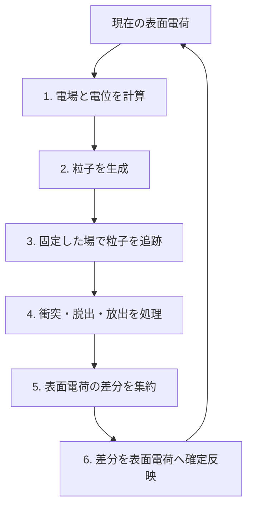

title: BEACH の計算サイクル

Lang: [日本語](Algorithms.md) | [English](Algorithms.en.md)

# BEACH の計算サイクル

このページは、「表面電荷、電場、粒子軌道をどの順番で更新するか」に答えます。
BEACH は、現在の表面電荷から場を計算し、その場の中で粒子を追跡し、表面へ到達した粒子の
電荷を反映する処理を batch 単位で繰り返します。

> **一番重要な規則**
>
> 一つの batch を計算している間、電場は変化しません。その batch で生じた電荷差分は
> batch 末尾で表面電荷へ確定反映され、次の batch の場から有効になります。

読了後には、`sim.dt`、`sim.batch_duration`、`sim.batch_count` の役割を区別し、出力履歴が
どの更新段階を表すか判断できるようになります。

## BEACH が直接計算する範囲

BEACH が保持する主な状態は、三角形要素ごとの表面電荷です。その電荷と設定した外場から電場・電位を求め、
固定した場の中で荷電粒子を表面への衝突または計算領域からの脱出まで追跡します。吸収と放出による
表面電荷の変化が、次の場へ影響します。

空間中に分布する粒子電荷や、計算領域の外側にある plasma の時間発展は直接計算しません。外部 sheath の
応答が必要な場合にだけ、別の[matching-plane 準定常連成](MatchingPlaneCoupling.html)を接続します。
対応済み・未対応機能の完全な一覧は [`SPEC.md`](../SPEC.md) を正本とします。

## 6 段階の計算サイクル

通常の構成では、この一周が一つの batch です。設定した `sim.batch_count` に達すると、最終メッシュ、
統計、履歴、checkpoint を出力して終了します。

## 一つの batch で起きること

1. **電場と電位を計算する。** batch 開始時の表面電荷から場を作ります。Direct、Treecode、FMM の
   どれを使っても、以後の粒子追跡が参照する場はこの時点で決まります。
2. **粒子を生成する。** 初期粒子、内部または領域外から入る粒子、表面から放出する粒子など、
   設定した供給方法に従って生成します。
3. **粒子を追跡する。** 一つの粒子を `sim.dt` ずつ前進させ、候補軌道と三角形・box 境界との
   最初の交差を探します。
4. **粒子の行き先を処理する。** 表面への吸収、境界の通過または反射、計算領域からの脱出、
   設定した表面放出を処理し、各粒子の結果を確定します。
5. **電荷差分を集約する。** 表面への吸収と放出で生じた変化を、三角形要素ごとの電荷差分として集めます。
   この時点では、batch 開始時の表面電荷そのものはまだ変えません。
6. **表面電荷へ確定反映する。** 集めた差分を一度だけ加え、統計と履歴を更新します。新しい電荷が
   電場へ反映されるのは、次の batch の手順 1 です。

衝突位置や open 境界 event の判定順は[粒子の衝突・境界 event](ParticleEvents.html)、吸収後の
表面処理は[表面はどう帯電するか](SurfaceModels.html)で説明します。

## batch の途中で場を変えない理由

同じ batch の全粒子に同じ場を使うことで、粒子追跡と表面電荷更新を分離できます。その代わり、
一つの batch で電荷を変えすぎると、固定した場という近似が粗くなります。

したがって、粒子軌道の時間刻みだけでなく、batch 当たりの電荷変化も独立に確認します。研究ケースでは
`sim.batch_duration` やマクロ粒子数を変え、電位・電荷・電流の結果が変わらない範囲を調べてください。
具体的な比較方法は [`batch_duration` をどう決めるか](BatchDurationStability.html)にまとめています。

## 3 種類の時間・回数を区別する

| 設定 | 変えるもの | 主に確認する出力 |
| --- | --- | --- |
| `sim.dt` | 一回の粒子前進と event 時刻の細かさ | 衝突位置、軌道、escape / survivor |
| `sim.batch_duration` | 時間比例の流入量と、表面電荷を更新する物理時間幅 | batch 当たりの注入数、電荷・電位・電流 |
| `sim.batch_count` | 計算サイクルを繰り返す回数 | 到達した物理時間、履歴の長さ、定常性 |

`sim.batch_duration=0` の `volume_seed` のように、粒子数を batch ごとに直接与えるケースには物理秒を
割り当てません。逆に境界流入など時間比例の粒子源では、流束と `sim.batch_duration` から粒子数を決めます。
`tol_rel` は表面電荷変化の監視値であり、現行実装の自動停止条件ではありません。

## batch 間で引き継ぐもの

次の batch は、更新後の表面電荷、累積統計、物理時間と、同じ粒子供給を続けるための状態を引き継ぎます。
checkpoint から再開するときも、必要な状態を復元して同じ計算サイクルを続けます。

内部状態、再試行時の復元、MPI / OpenMP の集約方法を変更する開発者は、
[ランタイムのアーキテクチャ](Architecture.html)と
[開発とテスト](Workflow.html)を参照してください。

## 通常と異なる実行経路

通常経路を理解した後、必要な機能だけを読んでください。

| 必要な機能 | 専用ページ |
| --- | --- |
| batch 当たりの場変化を制限し、短い幅で再試行する | [`batch_duration` をどう決めるか](BatchDurationStability.html) |
| 外部 1D sheath 応答と準定常に連成する | [matching-plane 準定常連成](MatchingPlaneCoupling.html) |
| 周期表面の平均場と非一様場を扱う | [periodic2 静電場](PeriodicElectrostatics.html) |
| solver を Direct、Treecode、FMM から選ぶ | [電場 solver の選び方](FieldSolvers.html) |

## 次に読むページ

- 実際に batch 間フィードバックを見る: [10 分チュートリアル](Tutorial.html)
- 粒子をどこから入れるか決める: [粒子をどこから入れるか](ParticleSourcesBoundaries.html)
- 表面モデルを選ぶ: [表面はどう帯電するか](SurfaceModels.html)
- 出力で電荷収支を確認する: [出力ファイルを調べる](OutputGuide.html)
- 離散化と物理的妥当性を検証する: [計算結果の妥当性確認](ValidationGuide.html)
