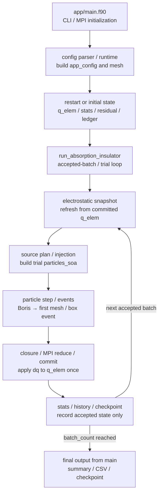

title: Developer Architecture Overview

Lang: [English](Architecture.en.md) | [日本語](Architecture.md)

# Developer Architecture Overview

This overview helps a developer new to the BEACH Fortran implementation move from the executable entry point to the
affected source and its direct tests. See [The BEACH computation cycle](Algorithms.en.html) for the ordinary physical and numerical
algorithm, and [Development Workflow](Workflow.en.html) for build and test selection. This page does not repeat every module;
it covers the runtime control flow, ownership of major state, and subsystem boundaries.

## Follow the execution flow



1. [`app/main.f90`](../app/main.f90) initializes the CLI, MPI, and performance profiler, then resolves the configuration path.
   `load_or_init_run_state` loads configuration and prepares the mesh and either initial or restarted state.
2. [`bem_app_config_parser.f90`](../src/config/app_config_parser/bem_app_config_parser.f90) reads TOML into `app_config`.
   Its finalize and validate submodules resolve derived values and combination constraints.
   [`bem_app_config_mesh_runtime.f90`](../src/config/bem_app_config_mesh_runtime.f90) builds `mesh_type` from templates or OBJ input.
3. `main` calls [`run_absorption_insulator`](../src/runtime/simulator/bem_simulator.f90). Its interface is in
   `bem_simulator.f90`, and its main loop is in [`bem_simulator_loop.f90`](../src/runtime/simulator/bem_simulator_loop.f90).
   [`bem_simulator_particles.f90`](../src/runtime/simulator/bem_simulator_particles.f90) handles particle generation and tracking,
   and [`bem_simulator_charge.f90`](../src/runtime/simulator/bem_simulator_charge.f90) handles charge commits, current corrections,
   and the ledger. The `bem_simulator_stats.f90` and `bem_simulator_io.f90` submodules implement statistics and history output.
4. The simulator refreshes [`electrostatic_snapshot_type`](../src/physics/bem_electrostatic_snapshot.f90) from committed
   `mesh%q_elem`. The snapshot stays fixed while particles in the same trial are tracked. Charge from an accepted commit
   first enters the field at the refresh for the next batch.
5. `build_particle_source_plan` and `prepare_batch_state` create the trial `particles_soa` from source settings and
   `batch_duration`. [`bem_app_config_particle_runtime.f90`](../src/config/bem_app_config_particle_runtime.f90) constructs
   particles from resolved configuration, and `src/particles/` implements distribution sampling.
6. `process_particle_batch` uses [`bem_particle_stepper.f90`](../src/runtime/simulator/bem_particle_stepper.f90) to build a
   predicted-midpoint field sample, Boris update, and candidate trajectory. `bem_collision.f90` and `bem_boundary.f90`
   select the first mesh hit or box event and branch to absorption, escape, reflection, or reintegration after a periodic wrap.
7. Hit charge and emission reaction charge accumulate in thread-local `dq` arrays owned by
   [`simulator_batch_workspace_type`](../src/runtime/simulator/bem_simulator_workspace.f90). After surface or current closure
   and MPI reduction succeed, `commit_batch_charge` adds the accepted trial to `mesh%q_elem` exactly once and, when enabled,
   redistributes conductor charge.
8. After commit, the simulator updates `sim_stats` and [`charge_ledger_type`](../src/runtime/coupling/bem_charge_ledger.f90),
   then writes histories and periodic checkpoints. Finally, `main` publishes the summary, CSV files, and final checkpoint
   through [`bem_output_writer.f90`](../src/runtime/bem_output_writer.f90).

[`bem_matching_plane_coupling.f90`](../src/runtime/simulator/bem_matching_plane_coupling.f90) owns matching-plane initialization,
trial state, fixed-point acceptance, and continuation-seed commits. The implicit mean-charge update and root search live in
[`bem_matching_plane_implicit.f90`](../src/physics/sheath/bem_matching_plane_implicit.f90). The main loop coordinates particle
replay, batch acceptance, and charge commits through these operations without directly changing their internal state.

Adaptive batch duration replays steps 5--7 from the same batch-start state. Matching-plane fixed-point coupling also updates
the response and snapshot gauge before replaying steps 4--7. Candidate charge, particle outcomes, RNG, macro-particle residuals,
and outer state from a rejected trial do not become accepted
state. See [`batch_duration` theory](BatchDurationTheory.en.html) and
[Quasistatic Matching-Plane Coupling](MatchingPlaneCoupling.en.html) for acceptance and rollback rules.

## Identify the owner of major state

| State | Owner and lifetime | Update rule |
| --- | --- | --- |
| `app_config` | Built by `main` and retained for the run | Passed read-only to the simulator after parser and runtime resolution |
| `mesh_type` geometry | Built by `main` and retained for the run | Vertices, panel geometry, and collision indexes are normally immutable |
| `mesh%q_elem` | Canonical surface charge owned by `mesh_type` | Initialized or restored before the run; thereafter updated only by `commit_batch_charge` for an accepted trial |
| `electrostatic_snapshot_type` | Derived cache retained by the simulator during a run | Refreshed from committed `q_elem` and fixed during particle tracking; it is not the canonical charge state |
| `particles_soa` | Particle batch for one trial | Created from sources, tracked to absorption, escape, or the step limit, then discarded |
| `simulator_batch_workspace_type` | Reusable simulator workspace | Holds thread-local `dq`, candidate charge, and outcome flags; values are not canonical before commit |
| `injection_state` and RNG | Continued between accepted batches and restored on restart | Preserve macro-particle residuals and the random sequence; restored to batch-start state after trial rejection |
| `sim_stats` | Cumulative state shared by `main` and the simulator | Accumulates accepted trials only and is saved to the summary and checkpoint |
| `charge_ledger_type` | Signed charge stock and flux for the run | Accumulates accepted transfers only and keeps conservation residual separate from unresolved charge |
| Output and checkpoint files | Serialized copies created from committed state by writers | Files do not own live runtime state; loaders restore state only after contract validation |

This separation identifies where a candidate value is produced and where accepted state becomes final. Updating a trial-local
array does not by itself update statistics, the ledger, histories, or checkpoints.

## Follow public entry points to their implementation

Public entry points coordinate call order and data transfer, delegating each format or physics domain to its owner.

| Responsibility | Public entry point | Implementation owner |
| --- | --- | --- |
| Field evaluation | `bem_field_solver.f90` | `_config` resolves configuration, `_tree` owns treecode topology and moments, `_fmm` manages panel geometry and charge state in the FMM core, and `_eval` dispatches evaluations |
| External sheath response | `bem_matching_plane_response_provider.f90` | The parent module owns model evaluation and feedback contracts; `_mpi` initializes from configuration, checks agreement across ranks, and broadcasts root evaluation results |
| Response table | `bem_matching_plane_response.f90` | The parent module shares immutable snapshots and interpolates responses; `_io` reads CSV, validates the grid |
| Fortran result output | `bem_output_writer.f90` | The `_history` submodule creates and appends histories, `_summary` writes the summary, and `_files` writes mesh, charge, and ledger CSVs |
| Checkpoint restart | `bem_restart.f90` | `_contract` validates restart conditions, `_records` reads statistics, charges, and the ledger, and `_injection` saves and restores RNG state and macro-particle residuals |
| Particle generation from configuration | `bem_app_config_particle_runtime.f90` | The parent module builds the source plan, `_batch` distributes work across MPI ranks and assembles batches, and `_sampling` handles species sampling and injection-velocity corrections |
| Python configuration | [`beach/config/core.py`](../beach/config/core.py) | [`_authoring.py`](../beach/config/_authoring.py) lowers spatial notation, and [`_runtime_validation.py`](../beach/config/_runtime_validation.py) calls field, particle, surface-current, and mesh validation in order |
| Python result loading | [`beach/fortran_results/io.py`](../beach/fortran_results/io.py) | Reads basic mesh and charge data, delegating coupling state to [`_matching_plane_io.py`](../beach/fortran_results/_matching_plane_io.py) and field-reconstruction metadata to [`_field_reconstruction_io.py`](../beach/fortran_results/_field_reconstruction_io.py) |

`field_solver_type%fmm_core_plan` owns FMM topology and interaction lists; `%fmm_core_state` holds charge-dependent work arrays.
The old FMM mirror view and unused local-expansion arrays have been removed. Inspect the core plan and state for diagnostics;
the treecode arrays do not describe FMM state. `init` releases existing FMM work arrays before rebuilding them. For example,
repeat `call solver%init(mesh, sim)` on the same `solver` after changing `sim%field_solver` to switch backends.
Use `refresh(mesh)` for charge changes; the FMM path also handles an empty mesh or a changed element count.
If vertex coordinates change while the element count stays the same, use `init` to rebuild geometry.

### Sheath and external-response responsibilities

`src/physics/sheath/` contains the stationary problem that determines fixed currents, the matching-plane problem that
responds to changing surface charge, and offline tools that generate response tables. The stationary problem imposes
zero net current; the matching-plane problem accepts displacement and particle fluxes. Their root searches solve
different boundary conditions.

| File under `src/physics/sheath/` | Responsibility |
| --- | --- |
| `bem_sheath_model_core.f90` | Zhao density, charge-density, and residual expressions, plus the stationary nonlinear solve |
| `bem_surface_current_model.f90` | Convert configuration and stationary sheath solutions into species absorption, emission, and inflow currents |
| `bem_surface_closure_contract.f90` | Data types for the currents and boundary conditions passed to the simulator; no model-specific solver |
| `bem_matching_plane_zhao.f90` | Solve A/B/C roots for supplied displacement and fluxes, select physical solutions, evaluate responses, and track continuation |
| `bem_matching_plane_implicit.f90` | Solve stiff mean charging with backward Euler, repeatedly evaluating the response, bracketing roots, and subdividing time when needed |
| `bem_matching_plane_response_provider.f90` | Common table / online Zhao entry point, feedback bounds and scales, and convergence checks |
| `bem_matching_plane_response_provider_mpi.f90` | Resolve provider configuration, check agreement on configuration and queries, and broadcast root responses |
| `bem_matching_plane_response.f90` | Store response tables, cache snapshots by path, interpolate in five dimensions, and expose interpolation axes |
| `bem_matching_plane_response_io.f90` | Parse CSV and validate column names, numeric syntax, grid completeness, and uniqueness |
| `bem_matching_plane_response_mpi.f90` | Broadcast the axes, values, height, and source path loaded by root |
| `bem_matching_plane_response_generator.f90` | Offline tool that evaluates online Zhao on a grid and writes a runtime response CSV |
| `bem_matching_plane_zhao_atlas.f90` | Offline diagnostic tool that explores A/B/C solvability and failure reasons |

The runtime `bem_matching_plane_coupling` uses the provider, going through `bem_matching_plane_implicit` when the implicit
method is selected. Neither generator nor atlas runs inside the normal batch loop. `src/physics/bem_surface_models*.f90`
owns charge redistribution and conductor conditions on the object, separately from the external sheath response.

Remaining readability concerns are the combination of formulas, Newton iteration, candidate selection, and continuation
in `bem_matching_plane_zhao`, and duplicated query CSV parsing in the generator and atlas. These are candidates for
further separation. Branch-admissibility tests and rejection of negative squared electric fields belong to the physical model.

Response-table hash comparisons have been removed; ranks receive the table loaded by root. Call
`table%get_axis_data(axis_sizes, axis_values, matching_plane_z_m, status, message)` when interpolation axes are needed.
Restart compares only the mesh identity; model, species, and response-content fingerprints are no longer generated.
The FMM operator cache retains an identity to prevent reuse under different operator conditions.

### Generate particle arrays directly

`allocate_particles(pcls, n)` in `bem_particles` owns allocation of arrays with exactly the requested nonnegative particle count.
The caller fills positions, velocities, charges, and masses. Weights default to 1, species IDs to 0, source elements to -1,
and `alive` to true. A count of zero allocates zero-length arrays and replaces any previous particles.
For example, stationary particles can be initialized directly as follows:

```fortran
use bem_kinds, only: dp, i32
use bem_types, only: particles_soa
use bem_particles, only: allocate_particles

type(particles_soa) :: pcls

call allocate_particles(pcls, 100_i32)
pcls%x = 0.0_dp
pcls%v = 0.0_dp
pcls%q = -1.602176634e-19_dp
pcls%m = 9.1093837015e-31_dp
```

`init_particles` continues to validate and copy existing arrays. Injection samplers write directly into their destination.
Batch assembly temporarily holds only each species' requested capacity and fills the completed SoA in the existing
round-robin species order. Random draw order and source-element provenance are preserved.

Mesh geometry updates reuse the centroid, normal, and area computed by `bem_panel_geometry`.
`fill_panel_quadrature(panel, position, weight)` writes quadrature points and weights into existing
`position(3,7)` and `weight(7)` arrays. Mesh construction uses this entry point to avoid allocating and copying temporary
arrays for each triangle. The existing `build_panel_quadrature` entry point shares this calculation when creating a plan.
Mesh updates write into the arrays for element `i` as follows:

```fortran
call fill_panel_quadrature(panel, mesh%panel_quad_position(:, :, i), mesh%panel_quad_weight(:, i))
```

Thin triangles excluded from panel integration retain their collision geometry.

## Move from a subsystem to its implementation and tests

The tests below are direct tests to run immediately after a change. Select the required cumulative gate from
[Development Workflow](Workflow.en.html#select-tests-from-the-change).

| Subsystem | Main source | Direct tests | Canonical source and explanation |
| --- | --- | --- | --- |
| CLI, configuration, and runtime resolution | `app/main.f90`, `src/config/` | [`test_app_config_parser.f90`](../tests/fortran/test_app_config_parser.f90), [`test_physics_config_types.f90`](../tests/fortran/test_physics_config_types.f90), `tests/python/test_config_schema.py`, `test_config_cli.py` | [Edit Configuration](Configuration.en.html), [Configuration Parameters](Parameters.en.html) |
| Meshes, templates, OBJ input, and panel geometry | `src/mesh/`, `src/physics/panel/` | [`test_templates_importers_runtime.f90`](../tests/fortran/test_templates_importers_runtime.f90), [`test_panel_geometry_near.f90`](../tests/fortran/test_panel_geometry_near.f90), [`test_panel_kernel.f90`](../tests/fortran/test_panel_kernel.f90) | [Configuration Recipes](ConfigurationRecipes.en.html), [Direct Solver](DirectSolver.en.html) |
| Batch orchestration | `src/runtime/simulator/bem_simulator*.f90` | [`test_simulator.f90`](../tests/fortran/test_simulator.f90), [`test_dynamics_basic.f90`](../tests/fortran/test_dynamics_basic.f90) | [`SPEC.md`](../SPEC.md), [The BEACH computation cycle](Algorithms.en.html) |
| Field snapshot, Direct / Treecode / FMM, and periodic2 | `bem_electrostatic_snapshot*.f90`, `src/physics/field_solver/`, `src/physics/periodic_zero_mode/` | [`test_electrostatic_snapshot.f90`](../tests/fortran/test_electrostatic_snapshot.f90), [`test_dynamics_field_solver.f90`](../tests/fortran/test_dynamics_field_solver.f90), `test_dynamics_fmm`, `test_periodic_zero_mode`, `test_periodic2_cached_snapshot` | [Field Evaluation](FieldSolvers.en.html), [FMM](FMM.en.html), [periodic2 Electrostatics](PeriodicElectrostatics.en.html) |
| Particle sources and injection | `bem_app_config_particle_runtime.f90`, `src/particles/` | [`test_injection_sampling.f90`](../tests/fortran/test_injection_sampling.f90), [`test_reservoir_injection.f90`](../tests/fortran/test_reservoir_injection.f90), [`test_external_field_velocity_grid.f90`](../tests/fortran/test_external_field_velocity_grid.f90) | [Choose where particles enter](ParticleSourcesBoundaries.en.html), [Inject particles through a boundary](ReservoirInjection.en.html), [Photoelectron Emission](PhotoelectronEmission.en.html) |
| Boris update, collision, and box events | `bem_particle_stepper.f90`, `bem_pusher.f90`, `bem_collision.f90`, `bem_boundary.f90` | [`test_particle_stepper.f90`](../tests/fortran/test_particle_stepper.f90), [`test_boundary.f90`](../tests/fortran/test_boundary.f90), `test_dynamics_basic` | [Particle Update](ParticleTrackingCollision.en.html), [Boris Pusher](BorisPusher.en.html), [Particle Events](ParticleEvents.en.html) |
| Surface charge, closure, and ledger | `bem_surface_models*.f90`, `src/physics/sheath/`, `bem_matching_plane_coupling.f90`, `bem_simulator_charge.f90`, `bem_charge_ledger.f90` | [`test_surface_models.f90`](../tests/fortran/test_surface_models.f90), [`test_surface_current_model.f90`](../tests/fortran/test_surface_current_model.f90), [`test_charge_ledger.f90`](../tests/fortran/test_charge_ledger.f90), `test_matching_plane_simulator` | [How surfaces charge](SurfaceModels.en.html), [Surface-charge update numerics](SurfaceChargeNumerics.en.html), [Matching-plane coupling](MatchingPlaneCoupling.en.html) |
| Statistics, output, checkpoints, and restart | `bem_simulator_stats.f90`, `bem_simulator_io.f90`, `bem_output_writer.f90`, `bem_periodic_checkpoint.f90`, `bem_restart.f90` | [`test_output_writer_io.f90`](../tests/fortran/test_output_writer_io.f90), [`test_output_writer_potential.f90`](../tests/fortran/test_output_writer_potential.f90), [`test_restart.f90`](../tests/fortran/test_restart.f90) | [Output Guide](OutputGuide.en.html), [Execution and Resume](Execution.en.html), output and restart contracts in `SPEC.md` |
| Python readers, analysis, and visualization | `beach/` | `tests/python/test_fortran_results.py` and the corresponding CLI or analysis tests | [Post-processing Tutorial](PostprocessTutorial.en.html), [Python API](PythonPostprocessAPI.en.html) |

Use the generated [Fortran Dependency Map](FortranDependencyMap.en.html) and
[Fortran API](https://nkzono99.github.io/BEACH/fortran/) to search module names and `use` dependencies. The dependency map is a
source inventory, not the canonical runtime call order, state-ownership description, or behavioral contract.

## Distinguish canonical ownership

| Information | Canonical source | Responsibility of guides and references |
| --- | --- | --- |
| Current simulation behavior and model scope | Fortran implementation and [`SPEC.md`](../SPEC.md) | Model and numerical-method pages explain rationale, equations, scope, and validation |
| Public TOML tables, keys, types, and structural constraints | `schemas/beach.schema.json`; the Fortran parser and validator own derived and semantic combinations | `Parameters.md` / `.en.md` is the searchable human reference; Configuration gives the editing procedure |
| Output-file generation conditions | `schemas/beach.output-manifest.json` and the Fortran writer | OutputGuide explains column meaning, inspection order, and restart roles |
| Checkpoint compatibility | Checkpoint contract, mesh identity, writer and loader, and `SPEC.md` | Execution gives the safe resume procedure |
| Test targets and tier membership | `fpm.toml` and `Makefile` | Workflow maps a changed area to the targets to run |
| Site page inventory and sidebar | `docs-site/navigation.json` | `docs/*.md` and `.en.md` are editable sources; `docs-site/src/content/docs/` is generated |
| Module and procedure API and dependencies | Fortran source, generated FORD API, and FortranDependencyMap | Architecture maintains only the human-readable execution flow and subsystem boundaries |

Tutorials, task guides, and examples are concise entry points that apply canonical contracts. They should link to a reference
or specification instead of duplicating every parameter and branch. When behavior, configuration, or output changes, use
[Change a Public Contract](Workflow.en.html#change-a-public-contract) to identify the files that must move together.
