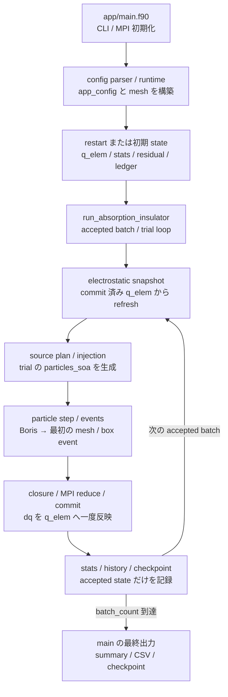

title: 開発者向けアーキテクチャ

Lang: [日本語](Architecture.md) | [English](Architecture.en.md)

# 開発者向けアーキテクチャ

BEACH の Fortran 実装を初めて変更する開発者が、実行入口から変更対象と直接 test まで移動するための概要です。
通常の物理・数値サイクルは[BEACH の計算サイクル](Algorithms.html)、build と test の選び方は
[開発ワークフロー](Workflow.html)を参照してください。このページは全 module の一覧を再掲せず、runtime の
制御フロー、主要 state の所有者、subsystem の境界だけを扱います。

## 実行フローを追う

1. [`app/main.f90`](../app/main.f90) は CLI、MPI、performance profile を初期化し、設定 path を解決します。
   `load_or_init_run_state` が設定を読み、mesh と初期 state または restart state を用意します。
2. [`bem_app_config_parser.f90`](../src/config/app_config_parser/bem_app_config_parser.f90) は TOML を
   `app_config` へ読みます。派生値と組合せ制約は parser の finalize / validate submodule で確定します。
   [`bem_app_config_mesh_runtime.f90`](../src/config/bem_app_config_mesh_runtime.f90) が template または OBJ から
   `mesh_type` を構築します。
3. `main` は [`run_absorption_insulator`](../src/runtime/simulator/bem_simulator.f90) を呼びます。interface は
   `bem_simulator.f90`、主 loop は [`bem_simulator_loop.f90`](../src/runtime/simulator/bem_simulator_loop.f90)、
   統計と履歴は `bem_simulator_stats.f90` と `bem_simulator_io.f90` の submodule に分かれます。
4. simulator は commit 済み `mesh%q_elem` から
   [`electrostatic_snapshot_type`](../src/physics/bem_electrostatic_snapshot.f90) を refresh します。
   同じ trial の粒子追跡中はこの snapshot を固定し、accepted commit の電荷は次の batch の refresh で初めて場へ入ります。
5. `build_particle_source_plan` と `prepare_batch_state` が、source 設定と `batch_duration` から trial 用の
   `particles_soa` を作ります。設定からの粒子構築は
   [`bem_app_config_particle_runtime.f90`](../src/config/bem_app_config_particle_runtime.f90)、分布 sampling は
   `src/particles/` が担当します。
6. `process_particle_batch` は [`bem_particle_stepper.f90`](../src/runtime/simulator/bem_particle_stepper.f90) を通して
   予測中点場、Boris 更新、候補軌道を作ります。`bem_collision.f90` と `bem_boundary.f90` が最初の mesh hit または
   box event を確定し、吸収、escape、reflect、periodic wrap 後の再積分へ分岐します。
7. hit 電荷と放出反作用電荷は [`simulator_batch_workspace_type`](../src/runtime/simulator/bem_simulator_workspace.f90) の
   thread-local `dq` に蓄積します。surface / current closure と MPI reduce が成功した accepted trial だけを
   `commit_batch_charge` が `mesh%q_elem` へ一度加え、必要なら conductor 電荷を再配分します。
8. commit 後に `sim_stats` と [`charge_ledger_type`](../src/runtime/coupling/bem_charge_ledger.f90) を更新し、履歴と定期
   checkpoint を書きます。`main` は最終的に [`bem_output_writer.f90`](../src/runtime/bem_output_writer.f90) から
   summary、CSV、最終 checkpoint を公開します。

adaptive batch-duration は手順 5--7 を同じ batch 開始 state から再生します。matching-plane 固定点反復では、
応答と snapshot の gauge も更新して手順 4--7 を再生します。棄却 trial の候補電荷、粒子 outcome、RNG、
macro 粒子端数、outer state は accepted state にしません。受理・rollback の
詳細は[`batch_duration` の理論](BatchDurationTheory.html)と
[matching-plane 準定常連成](MatchingPlaneCoupling.html)を参照してください。

## 主要 state の所有者を確認する

| State | 所有者と lifetime | 更新規則 |
| --- | --- | --- |
| `app_config` | `main` が構築し、run 全体で保持 | parser / runtime resolution 後は simulator へ read-only で渡す |
| `mesh_type` geometry | `main` が構築し、run 全体で保持 | 頂点、panel geometry、collision index は原則不変 |
| `mesh%q_elem` | `mesh_type` が持つ canonical な表面電荷 | run 前に初期化または復元し、その後は accepted trial の `commit_batch_charge` だけが更新する |
| `electrostatic_snapshot_type` | simulator が run 中に保持する派生 cache | commit 済み `q_elem` から refresh し、粒子追跡中は固定する。正本の電荷ではない |
| `particles_soa` | 1 trial の粒子 batch | source から生成し、吸収・escape・上限到達まで追跡した後に破棄する |
| `simulator_batch_workspace_type` | simulator が再利用する作業領域 | thread-local `dq`、候補電荷、outcome flag を保持する。commit 前は canonical state ではない |
| `injection_state` と RNG | accepted batch 間で継続し、restart で復元 | macro 粒子端数と乱数列を継続する。trial 棄却時は batch 開始 state へ戻す |
| `sim_stats` | `main` と simulator が保持する累積統計 | accepted trial だけを加算し、summary / checkpoint へ保存する |
| `charge_ledger_type` | run 全体の signed charge stock / flux | accepted batch の移送だけを累積し、保存残差と未解決量を別々に保持する |
| output / checkpoint files | writer が committed state から作る serialized copy | file 自体を runtime state の所有者にせず、loader が契約検査後に復元する |

この区別により、変更時には「候補値を作る場所」と「accepted state を確定する場所」を分けて確認できます。
trial-local 配列を更新しただけで、統計、ledger、履歴、checkpoint まで更新したとみなしてはいけません。

## Subsystem から実装と test へ移動する

表の test は変更直後に使う直接 test です。必要な累積 gate は[開発ワークフロー](Workflow.html#変更からテストを選ぶ)で
選びます。

| Subsystem | 主な source | 直接 test | 正本・解説 |
| --- | --- | --- | --- |
| CLI、config、runtime resolution | `app/main.f90`、`src/config/` | [`test_app_config_parser.f90`](../tests/fortran/test_app_config_parser.f90)、[`test_physics_config_types.f90`](../tests/fortran/test_physics_config_types.f90)、`tests/python/test_config_schema.py`、`test_config_cli.py` | [設定を編集する](Configuration.html)、[設定パラメータ](Parameters.html) |
| mesh、template、OBJ、panel geometry | `src/mesh/`、`src/physics/panel/` | [`test_templates_importers_runtime.f90`](../tests/fortran/test_templates_importers_runtime.f90)、[`test_panel_geometry_near.f90`](../tests/fortran/test_panel_geometry_near.f90)、[`test_panel_kernel.f90`](../tests/fortran/test_panel_kernel.f90) | [設定レシピ](ConfigurationRecipes.html)、[Direct](DirectSolver.html) |
| batch orchestration | `src/runtime/simulator/bem_simulator*.f90` | [`test_simulator.f90`](../tests/fortran/test_simulator.f90)、[`test_dynamics_basic.f90`](../tests/fortran/test_dynamics_basic.f90) | [`SPEC.md`](../SPEC.md)、[BEACH の計算サイクル](Algorithms.html) |
| field snapshot、Direct / Treecode / FMM、periodic2 | `bem_electrostatic_snapshot*.f90`、`src/physics/field_solver/`、`src/physics/periodic_zero_mode/` | [`test_electrostatic_snapshot.f90`](../tests/fortran/test_electrostatic_snapshot.f90)、[`test_dynamics_field_solver.f90`](../tests/fortran/test_dynamics_field_solver.f90)、`test_dynamics_fmm`、`test_periodic_zero_mode`、`test_periodic2_cached_snapshot` | [場の評価](FieldSolvers.html)、[FMM](FMM.html)、[periodic2 静電場](PeriodicElectrostatics.html) |
| particle source と injection | `bem_app_config_particle_runtime.f90`、`src/particles/` | [`test_injection_sampling.f90`](../tests/fortran/test_injection_sampling.f90)、[`test_reservoir_injection.f90`](../tests/fortran/test_reservoir_injection.f90)、[`test_external_field_velocity_grid.f90`](../tests/fortran/test_external_field_velocity_grid.f90) | [粒子をどこから入れるか](ParticleSourcesBoundaries.html)、[境界から粒子を流入させる](ReservoirInjection.html)、[光電子放出](PhotoelectronEmission.html) |
| Boris、collision、box event | `bem_particle_stepper.f90`、`bem_pusher.f90`、`bem_collision.f90`、`bem_boundary.f90` | [`test_particle_stepper.f90`](../tests/fortran/test_particle_stepper.f90)、[`test_boundary.f90`](../tests/fortran/test_boundary.f90)、`test_dynamics_basic` | [粒子更新](ParticleTrackingCollision.html)、[Boris](BorisPusher.html)、[粒子 event](ParticleEvents.html) |
| surface charge、closure、ledger | `bem_surface_models*.f90`、`src/physics/sheath/`、`bem_simulator_loop.f90`、`bem_charge_ledger.f90` | [`test_surface_models.f90`](../tests/fortran/test_surface_models.f90)、[`test_surface_current_model.f90`](../tests/fortran/test_surface_current_model.f90)、[`test_charge_ledger.f90`](../tests/fortran/test_charge_ledger.f90)、`test_matching_plane_simulator` | [表面はどう帯電するか](SurfaceModels.html)、[表面電荷更新の数値仕様](SurfaceChargeNumerics.html)、[matching-plane 連成](MatchingPlaneCoupling.html) |
| stats、output、checkpoint、restart | `bem_simulator_stats.f90`、`bem_simulator_io.f90`、`bem_output_writer.f90`、`bem_periodic_checkpoint.f90`、`bem_restart.f90` | [`test_output_writer_io.f90`](../tests/fortran/test_output_writer_io.f90)、[`test_output_writer_potential.f90`](../tests/fortran/test_output_writer_potential.f90)、[`test_restart.f90`](../tests/fortran/test_restart.f90)、`test_model_fingerprint` | [出力ガイド](OutputGuide.html)、[実行と再開](Execution.html)、`SPEC.md` の出力・再開契約 |
| Python reader、解析、可視化 | `beach/` | `tests/python/test_fortran_results.py`、対応する CLI / analysis test | [後処理チュートリアル](PostprocessTutorial.html)、[Python API](PythonPostprocessAPI.html) |

module 名や `use` 依存を検索するときは、自動生成した
[Fortran 依存関係マップ](FortranDependencyMap.html)と[Fortran API](https://nkzono99.github.io/BEACH/fortran/)を使います。
依存関係マップは source inventory であり、runtime の呼出順、state ownership、behavioral contract の正本ではありません。

## 正本の責務を区別する

| 情報 | 正本 | guide / reference の責務 |
| --- | --- | --- |
| 現行 simulation behavior と model scope | Fortran 実装と [`SPEC.md`](../SPEC.md) | model / numerical-method page は理由、式、適用範囲、検証方法を説明する |
| 公開 TOML の table、key、型、構造制約 | `schemas/beach.schema.json`。派生値と意味的な組合せは Fortran parser / validator | `Parameters.md` / `.en.md` は検索可能な人間向け reference、Configuration は編集手順を示す |
| output file の生成条件 | `schemas/beach.output-manifest.json` と Fortran writer | OutputGuide は column の意味、確認順、restart での役割を説明する |
| checkpoint compatibility | checkpoint contract、model fingerprint、writer / loader、`SPEC.md` | Execution は安全な再開手順を示す |
| test target と tier | `fpm.toml` と `Makefile` | Workflow は変更範囲から実行すべき target へ案内する |
| site の page inventory と sidebar | `docs-site/navigation.json` | `docs/*.md` と `.en.md` が編集する source で、`docs-site/src/content/docs/` は生成物 |
| module / procedure API と依存 | Fortran source、生成した FORD API、FortranDependencyMap | Architecture は人が読む実行フローと subsystem 境界だけを維持する |

tutorial、task guide、example は正本の契約を短く適用する入口です。そこへ全 parameter や全分岐を複製せず、
該当する reference または specification へリンクします。behavior、config、output を変更するときの同期対象は
[公開契約を変更するとき](Workflow.html#公開契約を変更するとき)で確認してください。
