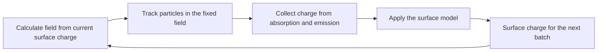

title: How surfaces charge

Lang: [日本語](SurfaceModels.md) | [English](SurfaceModels.en.md)

# How surfaces charge

This page explains where BEACH keeps charge after a particle reaches a triangulated surface. BEACH applies the charge
change produced within a batch exactly once, then uses the selected `surface_model` to determine surface charge for the
next batch.

> **Ordinary choice:** use `surface_model="insulator"` for local charging of an insulating surface. Choose
> `conductor` only when a floating conductor in free space should become equipotential.

After reading this page, you should be able to distinguish the two implemented models and identify material effects that
are absent from the result.

## Feedback between batches

Later particles in the same batch do not see the charge of particles absorbed earlier in that batch. The change becomes
final at batch end and first appears in the next batch's field. Test sensitivity to this lag by following
[how to choose `batch_duration`](BatchDurationStability.en.html).

## Choose a model

| `surface_model` | Treatment at batch end | Suitable target | Main limit |
| --- | --- | --- | --- |
| `insulator` | Retain charge on the hit element | Local charging of an insulator | Does not solve surface conduction or bulk leakage |
| `conductor` | Conserve total charge per `mesh_id` and redistribute element charge to become equipotential | Floating conductor in free space | `field_boundary.mode="free"` only |

`dielectric` is not implemented. Inputs `surface_model="dielectric"` and `epsilon_r` are rejected and are not aliases
for the insulator calculation.

## Insulator: retain charge at the hit location

`insulator` adds an absorbed macro-particle's charge to the triangle it hit and performs no redistribution to other
elements. Electrons leave negative charge and positive ions leave positive charge. A particle emitted from a surface
leaves reaction charge of the opposite sign at its source.

This model represents charge accumulation on a discretized surface. It does not include:

- lateral surface conduction, finite-resistance relaxation, or leakage into the bulk;
- permittivity interface conditions, polarization charge, or the electric field inside the object;
- general secondary-electron emission or specular / diffuse particle reflection.

If those effects control the time evolution, do not interpret an `insulator` result as the long-time response of the
real material.

## Floating conductor: conserve charge and equalize potential

`conductor` treats elements with one `mesh_id` as a single floating object. After applying particle charge, it
redistributes charge so element-centroid potentials are equal while preserving the object's total charge. It is not a
grounded, fixed-potential boundary.

The current implementation accepts only a free-space field and cannot be combined with periodic fields or an outer
matching-plane response. For research use, verify convergence of object potential and surface-charge distribution under
mesh refinement.

The linear system, P0-panel influence, parallel reduction, and conserved quantities are separated into
[surface-charge update numerics](SurfaceChargeNumerics.en.html).

## Difference from a photoelectron closure

`surface_charge_closure="neutral_return"` is not a material model that conducts charge across a surface. It is a source
closure that assigns unresolved closed-photoelectron return to the destination distribution observed in the same batch.
See the [finite-image periodic2 configuration](FinitePeriodicConfiguration.en.html) for its conditions and closed ledger.

## Read the output

`charge_C` in `charges.csv` is total charge [C] on each triangle. Divide it by element area to obtain surface-charge
density. `tol_rel` monitors the pre/post-batch change; it is not an automatic stopping condition in the current implementation.

See [inspect output files](OutputGuide.en.html) for the species-resolved ledger including absorption, emission, and escape.
See [surface-charge update numerics](SurfaceChargeNumerics.en.html) for equations and implementation ordering.

## Where to go next

- Choose a particle source: [Choose where particles enter](ParticleSourcesBoundaries.en.html)
- Test sensitivity to batch width: [How to choose `batch_duration`](BatchDurationStability.en.html)
- Inspect photoelectron reaction charge and return: [Photoelectron emission and lifecycle](PhotoelectronEmission.en.html)
- Search every key and constraint: [Input parameters](Parameters.en.html)
