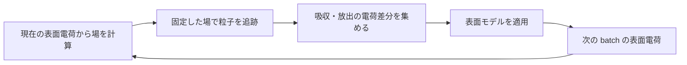

title: 表面はどう帯電するか

Lang: [日本語](SurfaceModels.md) | [English](SurfaceModels.en.md)

# 表面はどう帯電するか

このページは、粒子が三角形表面へ到達した後、その電荷をどこに保持するかを説明します。
BEACH は batch 中に生じた電荷差分を一度だけ確定反映し、選択した `surface_model` で次の batch の
表面電荷を決めます。

> **通常の選択:** 絶縁体の局所的な帯電を調べる場合は `surface_model="insulator"` を使います。
> 自由空間中の浮遊導体を等電位化する場合にだけ `conductor` を選びます。

読了後には、二つの実装済みモデルの違いと、結果に含まれない材料効果を判断できます。

## batch 間の feedback

同じ batch の後続粒子は、その batch で先に吸収された粒子の電荷を見ません。電荷差分は batch 末尾に
確定し、新しい場へ現れるのは次の batch です。この遅れへの感度は
[`batch_duration` をどう決めるか](BatchDurationStability.html)で確認します。

## モデルを選ぶ

| `surface_model` | batch 末尾の処理 | 適した対象 | 主な制約 |
| --- | --- | --- | --- |
| `insulator` | 命中した要素に電荷を保持する | 局所的な絶縁体帯電 | 表面伝導・bulk 漏洩を解かない |
| `conductor` | `mesh_id` ごとに総電荷を保ち、要素電荷を等電位になるよう再配分する | 自由空間中の浮遊導体 | `field_boundary.mode="free"` のみ |

`dielectric` は実装されていません。`surface_model="dielectric"` と `epsilon_r` は入力エラーになり、
`insulator` の別名としても扱いません。

## 絶縁体: 命中位置に電荷を残す

`insulator` は、吸収されたマクロ粒子の電荷を命中した三角形要素へ加え、他の要素へ再配分しません。
電子は負、正イオンは正の電荷を残します。表面から粒子を放出する source は、放出粒子と逆符号の
反作用電荷を放出元へ残します。

このモデルが表すのは、離散化した表面上の電荷蓄積です。次の効果は含みません。

- 表面内の横方向伝導、有限抵抗による relaxation、bulk への漏洩
- 誘電率境界条件、分極電荷、物体内部の電場
- 一般の二次電子放出、specular / diffuse な粒子反射

これらが時間発展を支配する対象では、`insulator` の結果を実在材料の長時間応答と読み替えないでください。

## 浮遊導体: 総電荷を保って等電位化する

`conductor` は、同じ `mesh_id` の要素を一つの浮遊導体として扱います。粒子の電荷を反映した後、物体の
総電荷を保ちながら、要素重心の電位が等しくなるよう電荷を再配分します。grounded な固定電位境界ではありません。

現行実装は自由空間場だけを受理し、周期場や外部 matching-plane 応答とは併用できません。研究利用では、
メッシュ細分化に対する物体電位と表面電荷分布の収束を確認してください。

連立方程式、P0 panel influence、並列集約、保存量は
[表面電荷更新の数値仕様](SurfaceChargeNumerics.html)に分離しています。

## 光電子 closure との違い

`surface_charge_closure="neutral_return"` は、表面内を伝導させる material model ではありません。
closed photoelectron の未帰還分を、同じ batch で観測した帰還先分布へ再配分する source closure です。
適用条件と閉じる電荷収支は[periodic2 有限画像構成](FinitePeriodicConfiguration.html)を参照してください。

## 出力を読む

`charges.csv` の `charge_C` は各三角形の総電荷 [C] です。表面電荷密度が必要なら要素面積で割ります。
`tol_rel` は batch 前後の変化を監視する出力であり、現行実装の自動停止条件ではありません。

species ごとの吸収・放出・escape を含む保存則は[出力ファイルを調べる](OutputGuide.html)、式と実装上の
更新順は[表面電荷更新の数値仕様](SurfaceChargeNumerics.html)で確認できます。

## 次に読むページ

- 粒子源を選ぶ: [粒子をどこから入れるか](ParticleSourcesBoundaries.html)
- batch 幅への依存性を調べる: [`batch_duration` をどう決めるか](BatchDurationStability.html)
- 光電子の反作用電荷と return を調べる: [光電子の放出とライフサイクル](PhotoelectronEmission.html)
- 全 key と制約を検索する: [入力パラメータ](Parameters.html)
