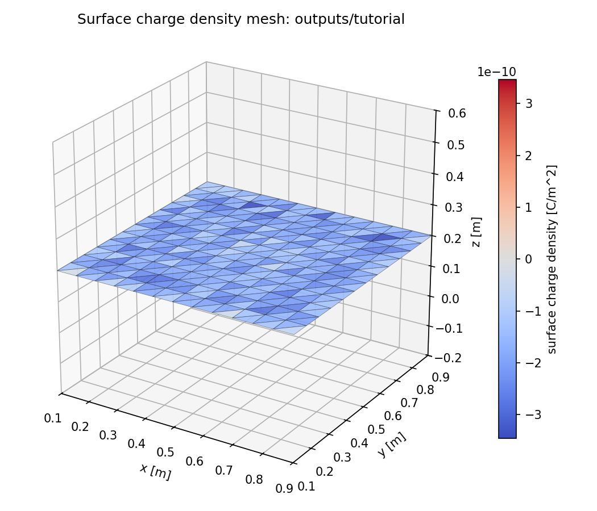

title: Ten-Minute Tutorial

Lang: [English](Tutorial.en.md) | [日本語](Tutorial.md)

# Ten-Minute Tutorial

This tutorial tracks one electron into an insulating plane and verifies absorption and surface charge deposition.
The official beginner case is a minimal finite-image `periodic2` setup on the x and y axes. It excludes an
infinite-periodic correction, photoelectrons, conductors, and dielectric models.

## 0. Check the installation

```bash
beach --version
beachx --help
```

If both commands run, you are ready to continue. If either command is missing, see
[Installation](Installation.en.html) first.

## 1. Create the configuration

```bash
mkdir beach-tutorial
cd beach-tutorial
beachx config init beach.toml
beachx lint beach.toml
```

`beachx config init` creates the official finite-image beginner case with periodic x and y axes. The generated file is identical to
[`examples/tutorial_insulator.toml`](https://github.com/Nkzono99/BEACH/blob/main/examples/tutorial_insulator.toml).
You do not need to read the full file yet. Start with these keys:

| Key | Value | Meaning in this case |
| --- | --- | --- |
| `batch_count` | `1` | Run one batch |
| `npcls_per_step` | `1` | Create one electron |
| `drift_velocity` | `[0.0, 0.0, -1.0e6]` | Direct the electron toward the plane |
| `surface_model` | `"insulator"` | Accumulate the absorbed electron's charge on the surface |
| `bc_x_low/high`, `bc_y_low/high` | `"periodic"` | Wrap particles into the primary x/y cell |
| `field_solver` | `"fmm"` | Compute the electric field with FMM |
| `field_bc_mode` | `"periodic2"` | Treat x and y as the two periodic field axes |
| `field_periodic_image_layers` | `1` | Sum the primary cell and one surrounding layer, totaling $3\times3$ cells |
| `field_periodic_far_correction` | `"none"` | Do not add an infinite-periodic correction beyond the finite images |
| `dir` | `"outputs/latest"` | Write results to this directory |

## 2. Run and confirm success

```bash
beach beach.toml
beachx inspect outputs/latest
```

A successful run creates `outputs/latest/summary.txt` and `outputs/latest/charges.csv`. This deterministic case
reports the following counts:

```text
processed_particles=1
absorbed=1
batches=1
survived_max_step=0
```

These counts mean that one electron was processed in one batch and absorbed by the plane before reaching the
maximum step count.

## 3. Inspect the deposited charge

```bash
beachx inspect outputs/latest --save-mesh outputs/latest/charge.png
```

In `charges.csv`, only the element hit by the electron receives negative charge. This result verifies the full path
from particle creation through collision detection, absorption, and surface charge deposition. It is not a
steady-state charging result.



## 4. Continue toward your goal

| Goal | First step | Related pages |
| --- | --- | --- |
| Change the particle count, launch region, velocity, or surface resolution | Edit `npcls_per_step`, `pos_low` / `pos_high`, `drift_velocity`, or `nx` / `ny` | [Design a Simulation Case](ConfigurationRecipes.en.html) |
| Read output files and analyze histories or distributions | Learn the roles of `summary.txt`, `charges.csv`, and history files | [Inspect Output Files](OutputGuide.en.html), [Post-processing Tutorial](PostprocessTutorial.en.html) |
| Understand particle updates, collisions, and surface charge updates | Follow the operations within one batch | [Algorithms](Algorithms.en.html) |
| Use results for research | Check sensitivity to the time step, mesh, and particle count | [Validating Simulation Results](ValidationGuide.en.html) |
