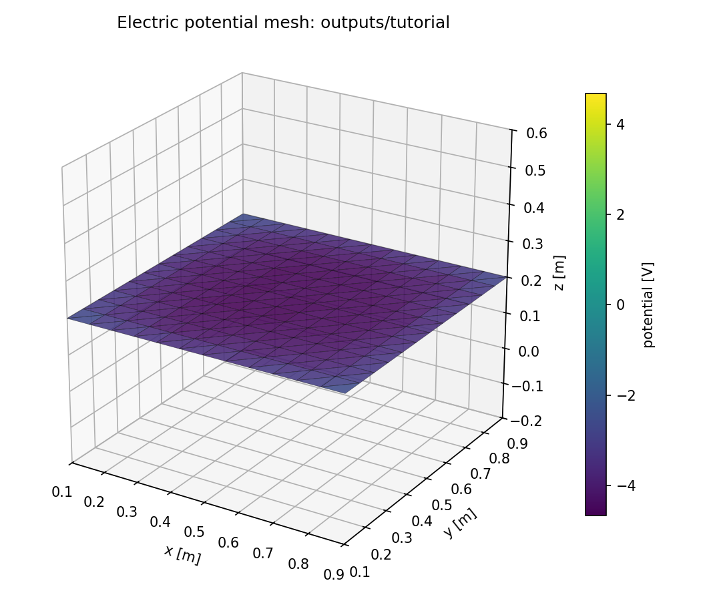
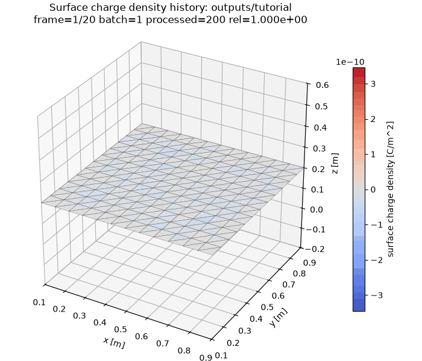

title: Ten-Minute Tutorial

Lang: [English](Tutorial.en.md) | [日本語](Tutorial.md)

# Ten-Minute Tutorial

This tutorial injects 200 macro-electrons per batch, 4,000 in total, toward an insulating plane for 20 batches. It shows a surface-charge
distribution forming at absorption locations and the accumulated field beginning to reflect electrons in later batches.

The case is designed to expose BEACH's batch-to-batch feedback. It is not a calibrated research environment and does not
claim a steady state or convergence in physical time.

## 0. Check the installation

```bash
beach --version
beachx --help
```

If both commands run, continue. Otherwise, see [Installation](Installation.en.html). On an HPC login node, do not run the
simulation directly; execute the remaining commands inside a compute-node allocation.

## 1. Create the configuration

```bash
mkdir beach-tutorial
cd beach-tutorial
beachx config init beach.toml
beachx lint beach.toml
```

The generated settings and behavior are identical to
[`examples/tutorial_insulator.toml`](https://github.com/Nkzono99/BEACH/blob/main/examples/tutorial_insulator.toml).
Comments, array wrapping, and other TOML formatting may differ. You do not need to memorize the full file. Start with
these relationships.

| Setting | Value | Role in this case |
| --- | --- | --- |
| `sim.batch_count` | `20` | Repeat charge commit and field refresh 20 times |
| `sim.dt` / `sim.max_step` | `5e-8 s` / `80` | Integrate each electron trajectory |
| `sim.field_solver` / `field_boundary.mode` | `direct` / `free` | Evaluate the finite plane's free-space field with Direct BEM |
| `npcls_per_step` | `200` | Create 200 macro-electrons in every batch |
| `w_particle` | `2e5` | Represent 200,000 electrons with each macro-electron so feedback appears in a short run |
| `pos_low` / `pos_high` | rectangle at z = `0.8 m` | Sample injection positions across a broad region above the plane |
| `drift_velocity` | `[0, 0, -1e6] m/s` | Direct electrons toward the plane |
| `mesh.templates` | 12 × 12 cells | Divide the plane into 288 triangles |
| `history_stride` / `write_potential_history` | `1` / `true` | Save charge and potential after every batch |

Every particle in one batch uses the same field fixed at the start of that batch. Absorbed charge is committed once at the
batch end and changes the field first used by the next batch. This sequence is central to BEACH.

## 2. Run the case

Use one OpenMP thread here to reproduce the reference random sequence.

```bash
OMP_NUM_THREADS=1 beach beach.toml
beachx inspect outputs/tutorial
```

A successful reference run reports:

```text
processed_particles=4000
absorbed=3720 escaped=280
batches=20
charge_sum=-1.192019e-10
potential_min=-4.671330e+00
potential_max=-2.579807e+00
```

`processed_particles=200 × 20` and `batches=20` follow exactly from the configuration. The absorption, escape, and potential
values above are references for `rng_seed=12345`, one thread, and the current version. Fine details may change with another
thread count or a future random-number implementation.

## 3. Why electrons escape in later batches

All 200 electrons are absorbed in each of the first 13 batches. As negative charge accumulates, the surface potential becomes
more negative and produces a field that opposes incoming electrons. Starting in batch 14, some electrons turn around and leave
through the upper open boundary.

The final surface charge is

$$
3720\times 2\times10^5\times(-e)
=-1.192019\times10^{-10}\ \mathrm{C},
$$

which agrees with `charge_sum`. The `charge_C` column in `charges.csv` is total charge [C] on each triangle. Plot colors show
that charge divided by triangle area, in C/m².

For this finite free-space surface, the Coulomb-potential convention approaches 0 V in the far field. No matching plane or
`reservoir.phi_infty` is connected, so do not reinterpret this potential as an outer-plasma potential.

## 4. View charge history and final potential

```bash
beachx inspect outputs/tutorial \
  --save-mesh outputs/tutorial/charge.png

beachx animate outputs/tutorial \
  --quantity charge \
  --save-gif outputs/tutorial/charge_history.gif \
  --total-frames 20
```


The final surface potential is already stored in `mesh_potential.csv`. Plot the saved values without recomputation by
setting `reference_point=None` explicitly.

```python
from beach import Beach

run = Beach("outputs/tutorial", config_path="beach.toml")
fig, _ = run.plot_potential(reference_point=None)
fig.savefig("outputs/tutorial/potential.png", dpi=150)
```





Reconstructing potential at arbitrary points or for every batch requires the native field kernel. Follow the optional
steps in the [Post-processing Tutorial](PostprocessTutorial.en.html) when you need that calculation.

## 5. What this result does and does not show

This run demonstrates that particle generation, orbit integration, collision and escape, element-wise charge commit, field
refresh, and history output are coupled across batches.

However, `w_particle` is a teaching value selected to expose feedback quickly, and a `volume_seed` with
`batch_duration=0` has no physical inflow rate in seconds. `last_rel_change` and `tol_rel` are not automatic stopping
conditions. Do not interpret these 20 batches as a steady charging state or as 20 seconds in a particular environment.

## 6. Continue

| Goal | Next page |
| --- | --- |
| Check output files and conservation | [Inspect output files](OutputGuide.en.html) |
| Resume once from the 20-batch checkpoint | [Run and resume](Execution.en.html#resume-once-from-a-checkpoint) |
| Change particle counts, geometry, or sources | [Design a simulation case](ConfigurationRecipes.en.html) |
| Understand batches, particles, and charge commits | [What BEACH solves and how a run advances](Algorithms.en.html) |
| Decide whether a research result is acceptable | [Validating simulation results](ValidationGuide.en.html) |
| Diagnose a failed run | [Troubleshooting](Troubleshooting.en.html) |
