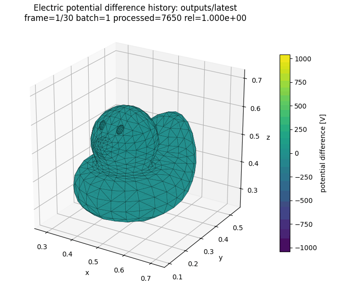

title: BEACH Documentation

Lang: [English](index.en.md) | [日本語](index.md)

# BEACH

BEACH computes the electric field from charge on triangular surfaces, tracks charged particles in that field,
and accumulates the charge of absorbed particles on the surfaces.

**[Start the ten-minute tutorial](Tutorial.en.html)** · [Read the BEACH computation cycle first](Algorithms.en.html)

## Your first 30 minutes

If this is your first use, follow these pages in order. Each page continues from the output of the previous one.

1. [Installation](Installation.en.html) — make `beach` and `beachx` available.
2. [Ten-minute tutorial](Tutorial.en.html) — follow many particles and surface-charge updates through 20 batches.
3. [Inspect output files](OutputGuide.en.html) — read `summary.txt` and `charges.csv`.
4. [Run and resume](Execution.en.html#resume-once-from-a-checkpoint) — continue the 20-batch result to batch 21.
5. [Troubleshooting](Troubleshooting.en.html) — separate lint, runtime, output, and restart failures.

The official beginner case is an end-to-end check. A zero exit status does not establish convergence or physical
validity. Before using a result for research, follow [Validating simulation results](ValidationGuide.en.html).

## What BEACH covers

| Solved directly by BEACH | Separate models or outside the present scope |
| --- | --- |
| Surface charge on each triangle element | A self-consistent volume plasma from charge distributed through space |
| Fields and potentials from surface charge and configured external fields | Collisional plasma transport outside the computational region |
| Charged-particle trajectories in a field fixed within each batch | Dielectric polarization or resistive conduction inside an object |
| Surface absorption, emission, and batch-by-batch charge updates | General secondary-emission and scattering models |
| An optional quasistatic boundary response at the top of the region | A time-dependent outer sheath or complete velocity-distribution solver |

See [The BEACH computation cycle](Algorithms.en.html) for the ordinary surface-charge update and the difference among
`dt`, `batch_duration`, and `batch_count`. See
[quasistatic matching-plane coupling](MatchingPlaneCoupling.en.html) for the spatial division when an outer sheath is attached.

## Choose a path

| Goal | Reading order |
| --- | --- |
| Build a research case | [Design a case](ConfigurationRecipes.en.html) → [Create and validate `beach.toml`](Configuration.en.html) → [Run](Execution.en.html) → [Validate](ValidationGuide.en.html) |
| Select particle sources or surface models | [Choose where particles enter](ParticleSourcesBoundaries.en.html) → [How surfaces charge](SurfaceModels.en.html) |
| Configure open boundaries and return | [Inject particles through a boundary](ReservoirInjection.en.html) → [Particle escape and return](ParticleEscapeReturn.en.html) |
| Include photoelectrons | [Photoelectron emission and lifecycle](PhotoelectronEmission.en.html) |
| Apply fixed currents from a stationary outer sheath | [Zhao stationary closure](ZhaoStationaryClosure.en.html) |
| Couple an outer one-dimensional sheath | [Quasistatic matching-plane coupling](MatchingPlaneCoupling.en.html) → [Validate with the offline kinetic oracle](OuterKineticOracle.en.html) |
| Select field solvers or periodic boundaries | [Field evaluation](FieldSolvers.en.html) → [periodic2 electrostatics](PeriodicElectrostatics.en.html) |
| Visualize output | [Post-processing tutorial](PostprocessTutorial.en.html) → [Python API](PythonPostprocessAPI.en.html) |
| Change the source code | [Architecture](Architecture.en.html) → [Development and testing](Workflow.en.html) |

## Documentation structure

### Get started

The overview, installation, and first run lead to a 20-batch, multi-particle charging result in which surface charge
changes later particle behavior.

### Build a case

Choose geometry, particle sources, boundary conditions, and a field solver from the physical goal, then validate,
run, and resume the configuration in task order.

### Inspect results

Start with a pass/fail check, then visualize, validate numerical and physical behavior, and diagnose failures.
Treat successful execution, numerical convergence, and physical validity as separate questions.

### Understand the models

These pages explain the ordinary computation cycle, surface charging, particle sources, photoelectrons, open boundaries,
the Zhao stationary sheath, periodic2, matching planes, and `batch_duration`. Read the ordinary path first and open an
advanced model only when needed.

### Reference

[Input parameters](Parameters.en.html), [output formats](OutputReference.en.html), numerical details, the
[Python API](PythonPostprocessAPI.en.html), and the [Fortran API](https://nkzono99.github.io/BEACH/fortran/)
are lookup references, not sequential tutorials.

### Developer guide

Start with [Architecture](Architecture.en.html), then use [Development and testing](Workflow.en.html),
[Physics release verification](PhysicsReleaseVerification.en.html), and the generated dependency map.

## Canonical ownership

| Information | Canonical source |
| --- | --- |
| Implemented behavior and invariants | [`SPEC.md`](../SPEC.md) and the Fortran implementation |
| Input keys, types, and machine validation | `schemas/beach.schema.json` |
| Output-file production conditions | `schemas/beach.output-manifest.json` |
| Task procedures | Tutorials and user guides on this site |
| Equations, assumptions, and applicability | The corresponding model or numerical-method page |

  
  
<i>Potential evolution on an insulating mesh under electron-beam irradiation</i>

  3D model: <a href="https://www.turbosquid.com/ja/3d-models/rubber-duck-pbr-game-ready-model-2001526">Rubber Duck PBR Game Ready</a> (TurboSquid)

